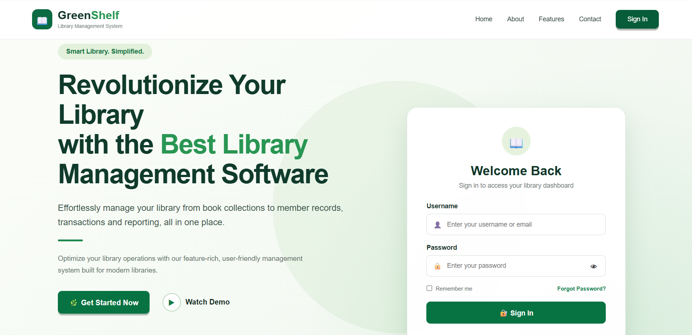
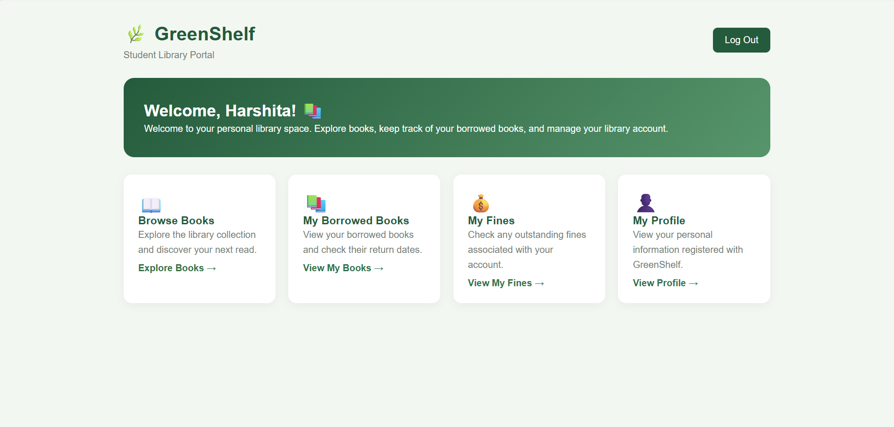
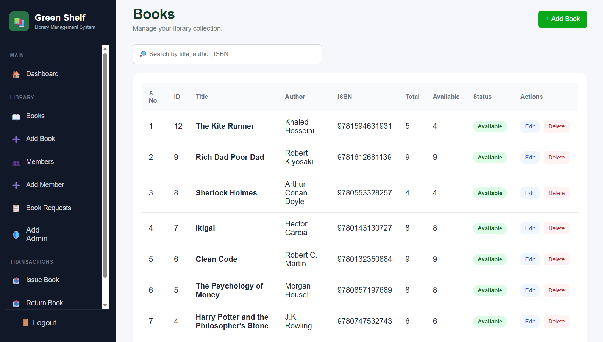
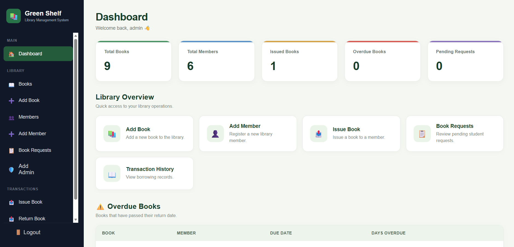

# 🌿 GreenShelf | Library Management System

GreenShelf is a web-based Library Management System designed to simplify library operations for administrators and provide students with a convenient way to explore and manage books.

The platform supports book management, book requests, issue and return tracking, and overdue fine management through separate student and administrator interfaces.

🔗 **Live Demo:** [https://greenshelf.infinityfreeapp.com/](https://greenshelf.infinityfreeapp.com/)

---

## 📸 Screenshots

<!-- Add screenshots to the screenshots/ folder and replace these paths -->

### Landing Page


### Student Dashboard


### Browse Books


### Admin Dashboard


---

## ✨ Features

### 👩‍🎓 Student Panel
- Student registration and login
- Browse and search for books
- Request books from the library
- View issued books and due dates
- Track overdue fines
- Manage profile information

### 🛠️ Admin Panel
- Admin authentication
- Add, edit, and delete books
- Manage registered members
- Issue and return books
- Manage book requests
- Track transactions and fines
- Add administrator accounts

### 📚 Library Management
- Track book availability
- Manage book issue and return records
- Calculate overdue fines at ₹5 per day

---

## 🧰 Tech Stack

| Technology | Purpose |
|---|---|
| PHP | Backend development |
| MySQL | Database management |
| HTML5 | Page structure |
| CSS3 | Styling and responsive design |
| JavaScript | Client-side interactions |
| PHPMailer | Email functionality |
| XAMPP | Local development environment |

---

## ⚙️ Installation and Setup

Follow these steps to run GreenShelf locally.

### 1. Clone the repository

```bash
git clone https://github.com/bainharshita/library-management-system.git
```

### 2. Move the project

Place the project folder inside your XAMPP `htdocs` directory.

### 3. Start XAMPP

Start **Apache** and **MySQL** from the XAMPP Control Panel.

### 4. Create the database

1. Open [http://localhost/phpmyadmin](http://localhost/phpmyadmin).
2. Create a database named `library_management`.
3. Import the SQL file located at `database/library.sql`.

### 5. Configure the database

Open `config/db.php` and configure the database connection using your local MySQL credentials.

```php
$host = "localhost";
$user = "root";
$password = "";
$database = "library_management";
```

Use the credentials appropriate for your local setup.

### 6. Run the application

Open the following URL in your browser:

[http://localhost:8080/library-management/login.php](http://localhost:8080/library-management/login.php)

If your Apache server uses a different port, adjust the URL accordingly.

---

## 🗂️ Project Structure

```text
library-management/
│
├── admin/              # Administrator panel
├── config/             # Database configuration
├── database/           # Database export
├── assets/             # CSS, JavaScript, and images
├── includes/           # Shared components
├── login.php           # Login page
├── index.php           # Application entry point
└── README.md            # Project documentation
```

*The folder structure above is illustrative. Adjust it to match the actual repository.*

---

## 🔐 Security Notes

- Do not commit database passwords, API keys, or email credentials.
- Configure sensitive credentials locally or through hosting environment settings.
- Use secure authentication practices when deploying the application.

---

## 👩‍💻 Author

**Harshita Bain**

B.Tech Computer Science and Engineering

[GitHub Profile](https://github.com/bainharshita)

---

## 📄 License

This project is intended for educational and portfolio purposes.